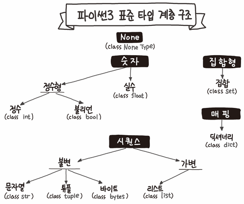

### 데이터 엔지니어가 알아야할 Python 정리(1)   

-------------------------------------

**먼저,Python은 인터프리터 언어일까?**   

##### python으로 프로그래밍을 시작하고 든 의문이다.
##### 우선 파이썬은 다음과 같이 동작한다.

1. ##### 인터프리터가 파이썬 코드를 바이트 코드로 변환한다.
2. ##### 바이트 코드가 PVM 위에서 실행된다.

##### 인터프리터가 파이썬 코드를 변환하고 나면 .pyc 파일이 생긴다.
##### 이 부분에서 이런 생각이 든다.
##### _그러면 이 .pyc파일은 컴파일 된 파일이지 않나?_   
##### 그래서 이곳저곳 찾아보다 이런 글을 발견했다.
##### [Python | Compiled or Interpreted ?](https://www.geeksforgeeks.org/python-compiled-or-interpreted/)    
#####     Python is interpreted language.   
#####     But that is half correct the python program is first compiled and then interpreted.   
#####     The compilation part is done first when we execute our code and this will generate byte code and internally this byte code gets converted by the python virtual machine(p.v.m) according to the underlying platform(machine+operating system).   

##### 파이썬이 인터프리터 언어라는건 반은 맞고 반은 틀린 사실이다.
##### 파이썬 프로그램은 처음에는 컴파일되고 그리고 interpreted된다.   
##### 컴파일러는 우리가 코드를 execute했을때 처음 동작하고 그리고 인터프리터가 바이트 코드로 변환 한 후 이 바이트 코드가 PVM 위에서 실행된다.
#####     Now the question is
    
#####     if there is any proof that python first compile the program internally and then run the code via interpreter?

#####     the answer is YES!
#####     and note this compiled part is get deleted by the python(as soon as you execute your code)
#####     just it does not want programmers to get into complexity.

***

**Python의 데이터 타입**   


##### 파이썬에서는 원시타입(Primitive Type)이 존재하지 않으며, 모든 것이 객체로 취급된다.

##### _나아가 클래스,함수 역시 객체로 취급할 수 있다. 상수 역시 상수가 저장된 객체라고 본다._



##### Python3의 자료형은 크게 Immutable Object와 Mutable Object로 나눌 수 있다. 

##### - Immutable Object(불변 객체) : 상수(숫자),문자열,바이트,Tuple

##### - Immutable object의 값을 수정할 떄는 바뀐 값이 저장된 새로운 객체를 생성하고 참조 대상을 새 객체로 옮기는 식으로 동작한다. -> 이와 같은 특징떄문에 파이썬은 순수 객체지향언어(OOP)라고 할 수 있다.

##### - Mutable Object(가변 객체): 위 불변객체의 4가지를 제외한 나머지 객체

***

**OOP: 클래스와 생성자**

##### 프로그램이 어떤 작업을 수행하기 위해서는 (1)데이터와 (2)데이터를 조작하는 행위, 두 가지 요소가 필요하다. 일반적으로 데이터는 변수에 넣어서 사용하고 데이터를 조작하는 일은 함수로 구성해서 쉽게 실행할 수 있도록 만들어 놓는다.

##### 객체(object, instance)는 서로 연관된 데이터와 그 데이터를 조작하기 위한 함수를 하나의 집합에 모아놓은 것을 말한다. 이 때 집합의 원소가 되는 변수나 함수는 멤버(member) 또는 속성(attribute)이라고 한다. 특히 객체의 속성인 함수는 메서드(method)라고 부른다.

##### 객체지향 프로그래밍에서 개체를 만들려면 객체를 바로 만들지 못하고 항상 class를 만든 후에 그 클래스를 이용하여 객체를 만들어야 한다.

##### _Constructor(생성자)_   
##### 파이썬에서 클래스를 정의하는 문법은 다음과 같다.
```python
class 클래스이름(object):
	def __init__(self, 속성값1, 속성값2, 속성값3):
	    self.속성이름1 = 속성값1
	    self.속성이름2 = 속성값2
	    self.속성이름3 = 속성값3
```

- ##### 속성값 인수는 필요하지 않다면 없어도 된다.
- ##### class 블럭안에 정의된 __ init __이란 함수는 constructor라고 하며 클래스 정의에서 가장 중요한 함수이다.
- ##### 객체를 생성할 떄는 클래스 이름을 함수처럼 호출해야하는데,이떄 실제로 __ init __으로 정의된 생성자 함수가 호출된다. 생성자 함수 내부에서는 생성자를 호출할 때 넣은 입력 변수, 즉 인자의 값을 속성값으로 저장한다.

***

**반복 가능한 객체: Iterable**

- ##### iterable 객체란? 반복 가능한 객체
    - ##### member를 하나씩 차례로 반환 가능한 object를 말한다.
    - ##### 대표적으로 iterable한 타입: list, dict, set, str, bytes, tuple, range

- ##### iterable에 대한 python docs의 정의   
    ##### An object capable of returning its members one at a time. Examples of iterables include all sequence types(such as list,str, and tuple) abd some non-sequence types like dict and file and objects of any classes you define with __ iter __ () or  __ getitem__() method. Iterables can be used in a for loop and in many other places where a sequence is needed (__zip()__,__map()__, ...). When an iterable object is passed as ab argument to the built-in function __iter()__, it returns an iterator for the objects youself. The for statement does that automatically for you, creating a temporary unnamed variable to hold the iterator for the duration of the loop. See also iterator,sequence and generator.

***

**Python의 인자 전달 방식**   

#### _Call by Assignment_
#### _Call by Object Reference_

##### Python은 명시적은 Call by Reference 혹은 Call by value라는 개념이 존재하지 않는다.   

##### Python의 function에 argument를 전달할 때, 이는 Manual에 따르면 __call by assignment__ 라는 방식으로 전달된다.

##### 이는 Parameter로 전달받는 객체에 따라 객체의 참조방식이 결정된다는 의미로, 공식 문서에 따르면 Mutable Object는 Call by reference의 형태로 참조형으로 변수를 다루며 Immutable Object는 Call by value의 형태로 변수를 핸들링한다.

- ##### __Mutable Object__ : list,dict,set 등의 객체
- ##### __Immutable Object__ : str,int,tuple 들의 객체

```python
def foo(a):
    a += 2
    print("local : "+ str(a))
    return a

def foo2(a):
    a.append(1)
    print("local : "+ str(a))

a = 10
foo(a)
print(a)

b = []
foo2(b)
print(b)


#결과

local : 12
10
local :[1]
[1]
```

##### foo 함수의 경우 int형을 핸들링하기 떄문에 call by value로 새로 변수를 할당해서 처리하는 모습을 보여주고 list를 입력받은 foo2 함ㄴ수의 경우 call by reference로 전달 받은 객체를 직접 변경하는 모습을 볼 수 있다.


***

**내가 일할때 도움이 되었던 문법&정보**   

##### [re 정규표현식 사용법](https://engineer-mole.tistory.com/189)  

##### [enumerate 함수 사용법](https://devpouch.tistory.com/74)   

##### [return에 대해(stackoverflow)](https://stackoverflow.com/questions/15300550/return-return-none-and-no-return-at-all/15300671#15300671)   


##### _글 작성시 참고한 링크_
[1](https://namu.wiki/w/Python)
[2](https://datascienceschool.net/01%20python/02.12%20%ED%8C%8C%EC%9D%B4%EC%8D%AC%20%EA%B0%9D%EC%B2%B4%EC%A7%80%ED%96%A5%20%ED%94%84%EB%A1%9C%EA%B7%B8%EB%9E%98%EB%B0%8D.html)
[3](https://bluese05.tistory.com/55)
[4](https://jins-dev.tistory.com/entry/Python-%EC%9D%98-Call-by-assignment-%EC%9D%98-%EA%B0%9C%EB%85%90)